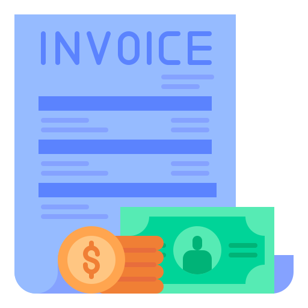

# Invoice PDF Generator

[](https://github.com/emads22/invoice-pdfgen-python/blob/main/LICENSE)



The Invoice PDF Generator is a Python package designed to simplify the process of creating PDF invoices from Excel invoice data. With this package, you can quickly generate professional-looking invoices for your business needs.

## Features
- **Easy to Use**: Generate PDF invoices with just a few lines of Python code.
- **Customizable**: Customize the appearance of your invoices by specifying fonts, colors, and layouts.
- **Excel Integration**: Read invoice data directly from Excel files, making it easy to manage and update invoice information.
- **Total Amount Calculation**: Automatically calculate the total amount due based on the invoice data.
- **Logo Support**: Add your company logo to the invoice for branding purposes.
- **Cross-Platform**: Works seamlessly on Windows, macOS, and Linux.

## Technologies Used
- **fpdf**: A library for creating PDF documents.
- **openpyxl**: A library for reading and writing Excel files.
- **pandas**: A data manipulation and analysis library.
- **setuptools**: A package development and distribution library.
- **twine**: A utility for publishing Python packages to PyPI.

## Installation
You can install the Invoice PDF Generator package via pip:

```bash
pip install invoice_pdfgen
```

For more information and usage instructions, visit the [PyPI page](https://pypi.org/project/invoice-pdfgen/).

## Usage
To use the Invoice PDF Generator package, follow these steps:

1. Import the `PDFInvoiceGenerator` class from the package.
2. Create an instance of the `PDFInvoiceGenerator` class, providing the paths to the Excel invoice file and the company logo.
3. Generate the PDF invoice using the `generate()` method.

```python
from invoice_pdfgen import PDFInvoiceGenerator

# Create an instance of PDFInvoiceGenerator
generator = PDFInvoiceGenerator(excel_filepath='invoice_data.xlsx', logo_filepath='company_logo.png')

# Generate the PDF invoice
generator.generate()
```

For more detailed usage instructions and examples, please refer to the [examples](./examples) directory.

## Documentation
For more detailed documentation, including API references and usage examples, please visit the [documentation](./docs/index.md).

## Examples
Check out the [examples](./examples) directory for usage examples of the Invoice PDF Generator package.

## Tests
The tests for the package can be found in the [tests](./tests) directory. You can run the tests using your preferred testing framework.

## Contributing
Contributions are welcome! Here are some ways you can contribute to the project:
- Report bugs and issues
- Suggest new features or improvements
- Submit pull requests with bug fixes or enhancements

## Author
- Emad &nbsp; E>
  
  [](https://github.com/emads22)

## License
This project is licensed under the **MIT License**, which grants permission for free use, modification, distribution, and sublicense of the code, provided that the copyright notice (attributed to [emads22](https://github.com/emads22)) and permission notice are included in all copies or substantial portions of the software. This license is permissive and allows users to utilize the code for both commercial and non-commercial purposes.

Please see the [LICENSE](LICENSE) file for more details.
